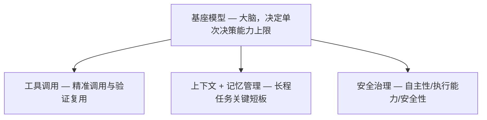

# 基模决定下限，Agent Harness 决定能力上限

> **演讲者**：郝建业（天津大学教授、MemoraX AI 创始人）
> **场合**：2026 中国 AI 智能体大会（AgenticAICon2026），7 月 2 日
> **核心论点**：基模决定智能体能力下限，Agent Harness 决定能力上限。

## 范式演进

```
Prompt Engineering → Context Engineering → Harness Engineering
   "如何向模型描述任务"  →  "如何让模型看到关键信息"  →  "如何让智能体持续可靠可控地完成任务"
```

> [!key-insight] 三阶段范式的本质
> 关注点从**模型输入**（prompt）→ **上下文组装**（context）→ **完整运行框架**（harness），反映了智能体从单次生成走向真实长程任务的产业需求。

代表案例：OpenClaw（统一 Gateway 入口）、Hermes（安全治理 + Skill 沉淀复用 + 自主演化）。

## 智能体核心架构



## 三大核心挑战

### 1. 工具调用

> 长程任务中如何自主选择、执行、验证、复用工具。

**技术演进**：

| 阶段 | 方法 | 时间 |
|------|------|------|
| 工作流编排 | 预定义工具调用范式 | 2025 前 |
| SFT 微调 | 少量轨迹微调 | 2025 初 |
| Agentic RL | RL 优化工具选择/参数填写/调用时机 | 2025–2026 |
| 长程任务 RL | 构造长程任务 + RL | 2026 |

代表工作：Tool-Star（数据合成 + 冷启动 SFT + 多阶段 RL）。

**三类场景**：

- **Search**：Search-o1、DualRAG — ReAct 自主反思 → RL 边推理边检索 → Deep Research（WebResearcher）
- **GUI**：沙箱环境 + 异步 RL + 并行候选轨迹（Simular Research）
- **Coding Agent**：单次生成 → 代码工程；Loop Engineering 提升自主性和可控性

### 2. 记忆管理

> 记忆是独立于基模的核心能力，非简单数据存储。

**技术趋势**：外挂式工作流记忆 → 学习式记忆模型（"记忆基模"）

| 工作 | 特点 |
|------|------|
| Mem0 / Mem0 2.0 | 工作流编排，轻量抽取 + 混合检索 + 多元实体建模 |
| LightMem（浙大） | 小压缩模型降低时间开销 |
| AgeMem（阿里） | 短期+中期+长期统一管理 + RL 奖励信号设计 |
| Seed | 多模态记忆 |
| **MemoraX（郝建业团队）** | Agentic RL 内生优化 + 归因驱动自演进 |

**评测基准**（郝建业团队）：
- 语言记忆：LoCoMo-Refined、ScriptMam
- 代码记忆：SWE Context Bench、CodeMemBenchmark（即将发布）
- 多方向 Leaderboard（联合牛津、浦江等高校）

> [!tip] 未来方向：参数化/隐式记忆
> 将记忆融入参数空间或隐空间，实现原生模型化记忆存储与调度。检索效率、推理能力、模型适配度上限更高，但距工业落地尚有距离。

### 3. 安全治理

> 从"识别恶意提示"转向"真实环境中约束智能体长期行为"。

| 攻击类型 | 说明 |
|----------|------|
| 提示词注入 | 恶意指令嵌入外部内容，操控智能体执行攻击者意图 |
| 工具攻击 | 隐蔽组合性攻击，利用工具调用能力漏洞 |
| 记忆攻击 | 篡改记忆系统，影响数据资产安全 |

防御：输入端注入防护 → 记忆/工具/输出全流程多层防御体系。

## 应用场景

| 场景 | 核心需求 | 记忆模型价值 |
|------|----------|-------------|
| 个人陪伴 | 超长交流历史管理 | 提升沉浸式体验 |
| 生产力工具（OpenClaw） | 用户长期历史信息管理 | 理解用户→提醒/管理/建议/执行 |
| Coding Agent | PR 历史、用户习惯 | 高效 Bug 修复 + 质量代码生成 |
| 医疗（慢性病管理） | 长期生活习惯/用药记录 | 针对性用药建议 |
| 网络安全 | 复杂漏洞挖掘/验证 | 利用历史代码路径+失败路径+候选 POC，减少探索空间 |

> [!note] 网络安全场景的战略意义
> 国产模型能力尚不及 SOTA（如 Claude Mythos），但通过更强的 Agentic Harness 能力（复杂任务管理 + 记忆能力），可以缩小差距——这正是"Harness 决定上限"论点的直接体现。

## 对 Agent Harness 开发的启发

1. **Harness 是能力上限的决定因素**：基模固定时，工具/记忆/安全三件套的质量直接决定智能体在真实任务中的表现。参见 [[harnessx-framework-composition]]。
2. **记忆是独立核心能力**：不应仅作为上下文管理的附属，而应作为独立模块设计——MemoraX 的"记忆基模"思路值得借鉴。参见 [[harnessx-sandbox-tools-rl]] 中 HarnessX 的 5 种压缩器。
3. **Agentic RL 是工具调用的主流方向**：从编排式→RL 自主演化是明确趋势。参见 [[harnessx-sandbox-tools-rl]] 中 SGLangProvider 的 GRPO 训练桥。
4. **安全治理需全链路**：从单点防御（prompt injection）升级为覆盖记忆/工具/输出的多层防护。参见 [[strands-sandbox-safety]]。
5. **评测基准是基础设施**：记忆能力评测（LoCoMo-Refined、SWE Context Bench）为 harness 优化提供量化依据。参见 [[harnessx-benchmark-evaluation]]。
6. **Harness Engineering 是范式终点**：从 Prompt→Context→Harness 的演进与 [[self-improvements-in-modern-agentic-systems]] 的二元架构（$A=(M,\Sigma)$）一致——$\Sigma$ 就是 Harness Engineering 的形式化。

## 关联笔记

- [[self-improvements-in-modern-agentic-systems]] — 自提升智能体综述（二元架构理论）
- [[harnessx]] — HarnessX（Harness Engineering 的工程实例）
- [[harnessx-framework-composition]] — 框架组合机制（九维分类）
- [[harnessx-sandbox-tools-rl]] — 沙箱/工具/RL 训练
- [[harnessx-benchmark-evaluation]] — Benchmark 评测体系
- [[strands-sandbox-safety]] — Strands 沙箱/安全
- [[strands-tool-system]] — Strands 工具系统
