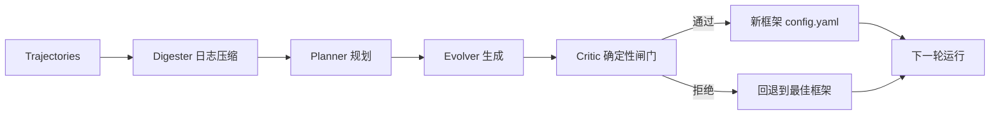

# HarnessX AEGIS 演化引擎

> [!key-insight] AEGIS 将框架演化建模为符号空间 MDP 强化学习
> 4 阶段流水线（Digester/Planner/Evolver/Critic）在实现中坍缩为：单个 MetaAgent（Digester+Planner+Evolver）+ 确定性 EvolveValidator（Critic）。阶段名只在文档中出现，实现里不是 4 个独立类。

## 4 阶段流水线



### Stage 1: Digester（日志压缩器）

- **实现**：`spawn_reflect_worker` 工具，`kind='trajectory-digester'`，对应 `workers/trajectory_digester.py`
- **子 agent**：只读工具（Read/Glob/Grep/Bash），叶节点（不能再 spawn）
- **输出**：5 段结构化摘要
  1. 按 `exit_reason` 聚合
  2. 按 eval 结果聚合
  3. 工具健康度
  4. 能力缺口
  5. 候选假设
- **自适应退出**：连续 2 条轨迹无新聚类时停止
- **步数预算**：~1 step/50KB，上限 80

### Stage 2: Planner（规划器，解决探索不足）

- **实现**：MetaAgent 在 agent turn 内推理（无独立模块）
- **输入**：CONTEXT.md，由 `journal.build_context()` 渲染
  - **杠杆记分板**：Beta(1+wh, 1+wm) 后验均值 + `0.9^rounds_ago` 时间衰减
  - **近期假设表**
  - **变更集**
  - **per-task 通过/失败矩阵**：按 stuckness/instability 排序
  - **已回退假设不重试列表**
- **输出**：`candidates.md`，每个候选含三轴标签（lens × lever × intent）
- **杠杆约束**：`{configuration, control, action, instruction}`
- **强制探索**：必须提出未探索的结构性优化方向

> [!tip] Beta 后验 + 时间衰减 = 杠杆信心的贝叶斯追踪
> 每个杠杆的历史命中/失误被建模为 Beta 分布后验，再做指数时间衰减，使元 agent 既能看到长期趋势又能偏向近期信号。

### Stage 3: Evolver（演化生成器）

- **实现**：MetaAgent 直接写文件
- **输出**：
  - `config.yaml`（必需）
  - 可选 `tools/<name>.py`
  - 可选 `processors/<name>.py`
  - 可选 `templates/<name>.j2`
- **`compute_changeset()`**：浅 diff 两个 canonical `HarnessConfig`（tools / processors / kwargs / templates）
- **SOUL.md 约束**：
  - 写策略而非解决方案
  - 无轨迹字面量（防过拟合）
  - 代码服务一类任务

### Stage 4: Critic（确定性闸门，必执行）

> [!warning] Critic 完全确定性，无 LLM 判断
> LLM 负责猜想、探索、生成；类型系统 + 确定性闸门负责最终上线准入。

**`EvolveValidator.run()` 三阶段**：

#### 1. VALIDITY（总是执行，首个失败即 `RuntimeError`）

- **canonicalize**：YAML 规范化 + 模板/Jinja 检查
- **contract**：处理器 hook-mutation 规则校验
- **changeset**：结构 diff → `changeset.json`
- **replay**：合成烟雾测试（`BaseTask 'Reply with exactly: OK'`，2步/$0.10/20s，通过真实 run loop）

> [!note] replay 是唯一保留的验证模式
> 早期的 `config_only` 与 `task_replay` 模式已被移除：前者与 canonicalize 冗余，后者与下一轮基准重复。Oracle 即 run loop 本身，agent 不写断言。

#### 2. POLICY（仅当 diff 非空）

- **novelty**：已回退的 `hypothesis_id` 不能重新提出；签名不能复用（除非提供 `retry_rationale`）
- **evidence**：`candidates.md` 必须存在且 journal 的 `cited_candidates` 交叉引用一致

#### 3. ADVISORY（永不阻断）

- **literals**：扫描 UUID 形硬编码字面量（阈值 3）

## MetaAgent

MetaAgent 是普通 HarnessX agent，其任务是演化 `HarnessConfig`：

- 每个基准运行实例化一次，每轮调用 `evolve()`
- `evolve()` 准备 `TASK.md` + `CONTEXT.md`，运行一个 agent turn（墙钟 900s / 500步 / $5），然后触发 `EvolveValidator`
- **安全处理器栈**：

| 处理器 | 职责 |
|---|---|
| `WriteScopeGate` | 只写 `output_dir` |
| `ReadScopeGate` | 禁读 harnessx 源码 |
| `LeakageGuard` | 模板泄漏自检（"这对未见过的任务有帮助吗？"） |
| `StepDeadlineReminder` | 步数/时间预算提醒 |
| `ContractAutoCheck` | 写入时自动校验契约 |

## 跨轮记忆：Journal

单个 markdown 文件，每轮一个 `## Round N` 段落。

> [!note] HTML 注释 frontmatter
> Journal 使用 `<!-- journal:frontmatter ... -->` 形式（HTML 注释包裹的 YAML），而非标准 `---` YAML frontmatter。机器可解析，同时在 GitHub 上渲染干净，不与 markdown 标题冲突。

**Schema**：`round`, `hypothesis_id`, `levers`, `predicted_affected`, `gating_outcome`, `gating_attribution`, `changeset`, `cited_candidates`

- `fill_gating()`：编排器在评估后回填结果，枚举值为 `flipped` / `still_F` / `regressed` / `still_T` / `absent`
- `build_context()`：为下一轮渲染 CONTEXT.md

## Seesaw 约束（防灾难性遗忘）

> [!warning] Seesaw 闸门在 recipe 的 `run.py` 中实现，不在 `validate_workflow.py`
> `validate_workflow.py` 负责每轮 post-flight 闸门；best-so-far seesaw 约束在 `_score_and_gate`（`recipe/gaia_evolver/run.py`、`recipe/tau2_evolver/run.py`）。`meta_harness` 包是基准无关的，对此闸门无感知。

```python
score = pass_rate - cost_weight * max(cost_delta, 0)
# 对比历史最佳（非上一轮），容差不能漂移
if score < best_score - tolerance:
    if abs(passed_delta) >= pass_count_noise_threshold:
        revert_to_best()
```

- **GAIA**: `tolerance=0.03`, `pass_count_noise_threshold=3`
- **TAU2**: `tolerance=0.02`, `cost_weight=0.0`

> [!tip] 对历史最佳而非上一轮
> 对比上一轮会导致容差漂移（每轮退一点，累积成灾难）。锁定历史最佳是防遗忘的关键设计。

## 框架-模型协同演化

### Level A: 框架演化（无模型微调）

AEGIS 循环在基准轮次间演化 `HarnessConfig`，模型权重冻结。信号源：benchmark pass/fail + judge 评判。

### Level B: 模型演化（GRPO 训练）

HarnessX 轨迹直接流入 GRPO 训练：

- `SGLangProvider` 捕获每轮 token IDs + logprobs
- `trajectory.to_rl_records(SlimeRLFormat)` 转换格式
- `reward_func()` 应用 PRM（过程奖励模型）
- **跨框架 GRPO**：同任务的所有轨迹（不同框架生成）归为同一组，组内策略差异作为梯度优势信号

### 共享回放缓冲区

一次任务采样同时供给框架演化和模型训练，无额外环境交互开销：

- 轨迹入库时缓存旧模型 logprobs，消除离线偏差
- FIFO 窗口限制缓冲区仅保留近期迭代

> [!note] Level A 与 Level B 不要混淆
> Level A（框架演化，模型冻结）= AEGIS 循环。Level B（模型演化，框架冻结/协同）= `rl/` + `recipe/slime` + `recipe/verl_harnessX`。桥梁是 `trajectory.to_rl_records()` + `build_rl_harness_config()`。

## Recipe 配置

| Recipe | 基准 | 特点 |
|---|---|---|
| `gaia_evolver` | GAIA | flat + per-domain 演化，LLMJudge per task，seesaw tolerance 0.03 |
| `tb2_evolver` | Terminal Bench 2 | `TB2RoundAdapter`，状态 JSON 原子写入，resume |
| `tau2_evolver` | TAU2 | 自驱动模拟循环，`RoundPoisonedError`（≥50% 基础设施错误中止），tolerance 0.02 |
| `slime` | RL 训练 | Slime custom `generate()` 接口，math / math_shaped / math_dense 配置 |
| `verl_harnessX` | RL 训练 | veRL `AgentLoopBase`，Qwen3.5 编码，`compute_score=0.8*acc+0.1*format+0.1*tool` |

## 对自研 harness 的启示

1. **LLM 生成 + 确定性闸门分工**：LLM 负责创新，代码负责安全——值得借鉴的演化架构
2. **Seesaw 对历史最佳**（非上一轮）防止容差漂移——重要的防遗忘设计
3. **Journal 的 Beta 后验 + 时间衰减**为元 agent 提供量化决策依据
4. **合成烟雾测试**（`'Reply with OK'`）是最小成本验证框架可启动的方式
5. **跨框架 GRPO**：同任务不同框架轨迹作为策略多样性来源——创新的训练信号
6. **LeakageGuard**：模板泄漏自检（"这对未见过的任务有帮助吗？"）——重要的泛化保障
7. **变体隔离**在当前实现中是 roadmap 项目，尚未完全实现——我们可优先考虑

> [!warning] 变体隔离为 roadmap [INFERENCE]
> 当前实现没有 population-level variant evolution 的专用模块。最接近的机制是 worker 隔离（工具注册表 = parent ∩ allowed，叶节点，静态 prompt）和每轮 config 重建。真正的变体演化在 ROADMAP section 2 中规划，尚未落地。

## 参考

- 源码：`harnessx/meta_harness/`（`agent.py` 37KB, `validate_workflow.py` 52KB, `journal.py` 30KB）
- 源码：`harnessx/rl/` + `recipe/slime/` + `recipe/verl_harnessX/`
- 源码：`recipe/gaia_evolver/`, `recipe/tb2_evolver/`, `recipe/tau2_evolver/`
- [[harnessx]] — 源摘要
- [[harnessx-framework-composition]] — 框架组合
- [[harnessx-sandbox-tools-rl]] — RL 训练桥
