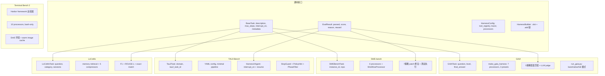

# HarnessX Benchmark 评测体系

> 5 个基准适配器（GAIA/SWE-bench/TAU2/Terminal Bench 2.0/LoCoMo）基于约定式适配器模式，共享 BaseTask + EvalResult 接口，提供可复制的评测方法论。

## 适配器架构

> [!note] 没有抽象基类
> 没有共享的 BenchmarkAdapter 基类——模式是约定式的。每个基准独立实现 Task/Harness/Evaluator/Runner 四件套。



## 通用接口

### BaseTask

```python
@dataclass
class BaseTask:
    description: str | list  # 任务描述
    success_criteria: str = ""
    max_steps: int = 50
    token_budget: int | None = None
    max_cost_usd: float | None = None
    interrupt_on: list[str] | None = None  # 工具调用前暂停
    metadata: dict = field(default_factory=dict)
```

### EvalResult

```python
@dataclass(frozen=True)
class EvalResult:
    passed: bool
    score: float  # 0-1
    reason: str
    reward: float = 0.0
```

## 各基准评测方法

### GAIA：多策略答案匹配

- **答案提取**：正则 `FINAL ANSWER:` / `the answer is:` / 最后一行
- **5 策略匹配**：精确匹配 → 归一化匹配 → 数值容差（整数 1%、浮点 3%）→ 模糊匹配（SequenceMatcher ≥0.9）→ 多部分包含
- **归一化**：移除 markdown、冠词、标点，数字单词转数字
- **LLM judge 回退**：无 ground truth 时用 LLM 判断
- **3 种执行模式**：bare（无工具单次调用）、native_tools（OpenAI function-calling）、full（完整 HarnessX）
- **模型 preset**：default(Claude 15步/$2)、gpt5(40步/$15)、qwen35_9b(12步/$5)

### SWE-bench：7 策略 Patch 修复

- **Patch 提取**：从工具输出/assistant 消息中搜索 `diff --git`
- **7 策略渐进修复**：修复裸 `@@` 头 → 重算 hunk 计数 → git strict → git lenient(`-C0`) → git 3way → 重定位 hunk（70% 匹配阈值）→ patch `fuzz=3`
- **测试执行**：重置 repo → apply `test_patch` → apply model patch → 运行 `FAIL_TO_PASS` 测试
- **本地评估**（`evaluate_local.py`，818 行）：Docker-free，`ProcessPoolExecutor` 并行
- **远程评估**：官方 SWE-bench Docker harness

### TAU2-Bench：用户模拟 + 工具交互

- **适配器**：`HarnessXAgent(HalfDuplexAgent)` — 用 `interrupt_on=ALL_TOOL_NAMES` 在工具执行前暂停，返回 tau2 执行工具
- **StopGuard**：剥离 GPT 用户模拟器的过早 `###STOP###`，恢复 ~8pp retail 性能
- **PolicyHint**：telecom 域 8 条规则注入 system prompt
- **PhaseAwareToolFilter**：前 2 轮只暴露只读工具
- **评分**：`reward_info.reward`（0-1 浮点，非 pass/fail）

### Terminal Bench 2.0：DinD + Harbor

- **DinDDockerEnvironment**：overlay→host 路径翻译，warm image cache（跳过已安装包）
- **HarborSandbox**：`setsid` 创建进程组，输出截断 8000 字符
- **10 processors**：含 SelfVerify（退出前注入验证清单）、Compaction+PostCompactionRefresh（压缩后重注入工作区快照）
- **评分**：Harbor 外部验证器运行 `test.sh`

### LoCoMo：长对话记忆

- **5 种压缩器**：verbatim（零 LLM）、summary、facts、light-memory（规则）、light-memory+LLM
- **多指标**：summarization→ROUGE-L、adversarial→exact match、其他→F1
- **LLM judge**：gpt-4o-mini × 3 轮，宽松评分

## 可复用模式（为自研 harness 提供 bench 依据）

> [!key-insight] 以下 15 个模式可直接用于自研 harness 的 benchmark 套件

1. **BaseTask + EvalResult 接口**：保持 frozen EvalResult (passed/score/reason/reward) 作为通用契约
2. **HarnessBuilder 管道**：通过 fluent `.add()` 链按基准组合不同 processor 栈
3. **模型 preset**：per-model 调优常量（步数、成本、token 比例）放 `defaults.py`
4. **双评估路径**：in-processor（`EvaluationProcessor`）用于训练，external 用于干净轨迹
5. **Harness pool + semaphore**：每并发槽一个 HarnessConfig 实例保证线程安全
6. **增量 JSONL + resume**：每任务后 flush，重启时跳过已完成 task_id
7. **带 hint 的重试**：budget_exceeded→'be more focused'，wrong answer→'try different method'
8. **基线模式**：bare（无工具）、native-tools（朴素循环）、full orchestration——用于消融
9. **渐进式 patch 修复**：多策略回退处理畸形模型输出
10. **阶段感知工具过滤**：按任务阶段限制工具，防止过早行动
11. **工作流引导**：步数 nudging 和反道歉覆盖，引导模型行为
12. **warm image/snapshot 缓存**：跳过重复运行的昂贵 setup
13. **压缩后刷新**：上下文压缩后重注入工作区状态
14. **自验证注入**：模型退出前强制验证清单
15. **时间预算提醒**：70%/90% 墙钟超时警告

## 执行模式

```python
# run_*.py 入口模式
async def main():
    tasks = load_tasks_from_dataset()         # HF/JSON 加载
    harness_pool = build_harness_pool(N)      # N 个并发槽
    sem = asyncio.Semaphore(concurrency)

    async def run_one(task):
        async with sem:
            harness = get_harness(harness_pool)
            result = await harness.run(task)
            write_jsonl(result)               # 增量输出

    await asyncio.gather(*[run_one(t) for t in tasks])
    print_summary(results)                    # 分组统计
```

## 采集的指标

- Pass/fail, score `[0,1]`, reward `[0,1]`
- total_steps, total_tokens, total_cost_usd, elapsed_s, exit_reason
- 分 level/domain/category 统计
- GAIA: per-level accuracy, exit_reason 分布
- SWE-bench: resolved %, has_patch %, patch_lines
- TAU2: reward, db_match, actions passed/total
- LoCoMo: F1, exact_match, ROUGE-L, per-category aggregate

## 参考

- 源码: `benchmarks/` 目录
- `benchmarks/README.md` — 结果对比表
- [[harnessx]] — 源摘要
- [[harnessx-framework-composition]] — 框架组合机制
- [[strands-agents-sdk]] — Strands SDK 对比
