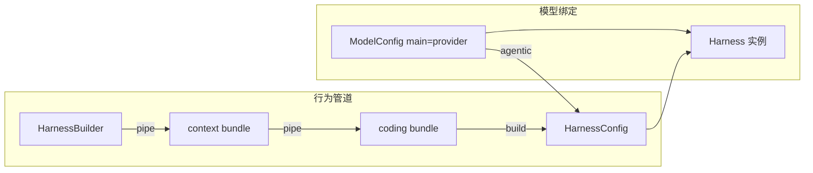
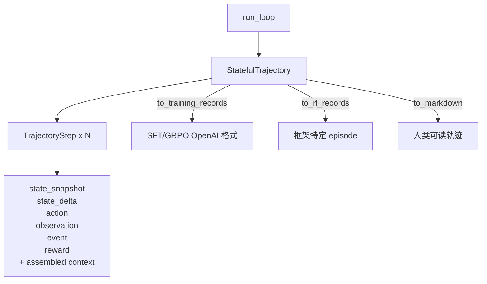

# HarnessX 框架组合机制

> [!key-insight] 框架是一等公民对象
> HarnessX 把整个框架抽象为**可序列化、可哈希、可等价对比、可整体替换**的一等公民对象。这是实现自动演化（[[harnessx-aegis|AEGIS]]）的底层基础——演化器必须能把一个框架实例当成基因来变异、交叉、评估。

## 双组合点

HarnessX 的组合在**两个正交维度**上发生，彼此完全解耦：

```python
# 维度 1：HarnessConfig — 行为管道（不含模型）
harness_config = (HarnessBuilder() | context | coding).build()

# 维度 2：ModelConfig — 模型绑定
harness = LiteLLMProvider("claude-sonnet-4-6").agentic(harness_config)
```



> [!warning] ModelConfig 与 HarnessConfig 完全解耦
> `HarnessConfig` 没有 `model_provider` 字段。模型只能通过 `ModelConfig(main=...).agentic(config)` 绑定。这意味着同一个行为管道可以在不同模型之间无缝迁移，也意味着 AEGIS 演化器可以独立变异"行为基因"和"模型基因"。

## 8 个生命周期钩子

框架在 `run_loop` 的每一步触发 8 个事件钩子，处理器按 `_order` 顺序串联执行：

| 钩子 | 事件类型 | 可修改内容 | 语义边界 |
|---|---|---|---|
| `task_start` | `TaskStartEvent` | system_prompt | 整个任务冻结后不可改 |
| `step_start` | `StepStartEvent` | 历史上下文结构 | 不能修改 system window |
| `before_model` | `BeforeModelEvent` | 用户输入追加/修改 | 只能 +1 user 消息 |
| `after_model` | `ModelResponseEvent` | 模型输出、工具调用指令 | — |
| `before_tool` | `ToolCallEvent` | 工具入参、执行审批标记 | — |
| `after_tool` | `ToolResultEvent` | 工具返回结果 | — |
| `step_end` | `StepEndEvent` | 只读 | 仅观测 |
| `task_end` | `TaskEndEvent` | 只读 | 仅观测 |

> [!note] 与 Strands 的对比
> Strands 的 [[strands-hooks-middleware|hooks/middleware]] 只有 `before/after` 两层回调。HarnessX 的 8 钩子切分更细，且每个钩子有明确的"可修改内容"契约，由 `contract_check` 在开发时静态验证。

## Processor 抽象

Processor 是 HarnessX 的核心扩展原语——一个异步生成器协议，接收事件、产出零到多个事件：

```python
@runtime_checkable
class Processor(Protocol):
    async def process(self, event: Event) -> AsyncIterator[Event]: ...
```

### 5 种输出行为

一个 Processor 的 `process` 方法可以产生 5 种语义截然不同的输出：

| 行为 | 代码形态 | 语义 |
|---|---|---|
| **透传 pass-through** | `yield event` | 原样传递，仅观测 |
| **转换 transform** | `yield dataclasses.replace(event, ...)` | 修改事件字段 |
| **拆分 split** | `yield ev1; yield ev2` | 一个事件变多个（如 `ModelResponseEvent` + `SpawnSubAgentEvent`） |
| **拦截 intercept** | `yield nothing` | 管道截断，事件不继续传播 |
| **中断 interrupt** | `raise BudgetExceededError(...)` | 抛出控制流异常终止 run_loop |

> [!tip] split 是关键能力
> `split` 让一个处理器能在模型响应后同时触发"工具执行"和"子 agent 派生"两条路径。这在 Strands 的纯 before/after 回调模型中无法表达。

### MultiHookProcessor 基类

手写 `process` 需要手动分发事件类型，繁琐且易错。`MultiHookProcessor` 提供声明式基类：

```python
class LifecycleLogger(MultiHookProcessor):
    async def on_before_model(self, event):
        print(f"→ model step={event.step_id}")
        yield event

    async def on_step_end(self, event):
        print(f"← step={event.step_id} tokens={event.cumulative_tokens}")
        yield event
```

其内部机制：

- **`_DISPATCH` 表**：自动映射事件类型 → `on_*` 方法名，未覆盖的钩子默认透传
- **`@on(EventClass)` 装饰器**：支持自由命名方法（不局限于 `on_*` 约定）
- **`_order`**：`PRE=0` / `NORMAL=50` / `POST=100`，控制同钩子内的执行优先级
- **`_singleton_group`**：互斥分组，同组内只能存在一个处理器
- **`_after`**：软依赖声明，确保某处理器在另一个之后运行

## HarnessBuilder 与 `|` 组合

`HarnessBuilder` 是**不可变工厂**——所有方法返回新 builder 实例，支持链式调用：

```python
config = (
    HarnessBuilder()
    .slot(tool_registry=registry, workspace=ws)
    .add(MyProcessor())
    | context      # bundle: 预组合的 builder
    | coding       # bundle: 包含 reliability + 环境注入
).build()
```

`|` 运算符对两个 builder 做**并集合并**，并在 `build()` 时统一执行冲突检测。

### 冲突检测

合并并非无脑 union，`build()` 会收集所有冲突后**统一抛出** `HarnessConflictError`：

| 冲突类型 | 检测逻辑 |
|---|---|
| **slot 冲突** | 两个 builder 对同一 slot 设置了不同对象 |
| **工具名冲突** | 注册了同名工具 |
| **singleton_group 碰撞** | 同一互斥组内出现多个处理器 |

> [!warning] 冲突在 `build()` 时才报错
> `|` 运算本身不抛错（保持不可变组合的流畅性），所有冲突延迟到 `build()` 统一收集。这让用户能先完成整个组合表达式，再一次性看到所有问题。

### 拓扑排序

`build()` 对处理器按 `_order` 分桶，桶内用 **Kahn 算法**做拓扑排序：

1. 按 `_order`（PRE / NORMAL / POST）分三个桶
2. 桶内按 `_after` 软依赖建 DAG，Kahn 拓扑排序
3. `_after` 声明的依赖如果跨桶（如 NORMAL 声明 `_after` 某个 POST 处理器），会报循环依赖错误

## 13 个 Control 处理器

HarnessX 内置 13 个控制层处理器，覆盖上下文管理、成本、可靠性、安全等维度：

| 处理器 | 钩子 | 功能 |
|---|---|---|
| `CompactionProcessor` | `step_start` | 双触发（140k token 或 100 条消息），摘要驱逐部分历史 |
| `CostGuardProcessor` | `before_model` | `max_usd` 超限抛 `BudgetExceededError` |
| `LoopDetectionProcessor` | `step_start` | 精确指纹（warn 3 / raise 5）+ 名称策略（warn 8） |
| `ParseRetryProcessor` | `after_model` | 工具调用结构校验，连续错误超限抛异常 |
| `ToolCallCorrectionLayer` | `before_tool` | 布尔/整数强转、路径归一化、枚举大小写修正 |
| `SelfVerifyProcessor` | `task_start` + `before_model` | 退出前注入验证清单 |
| `TodoCheck` | `step_start` + `before_model` | 无工具步后提醒待办 |
| `RepeatedFileEditDetector` | `before_tool` + `after_tool` | 同文件编辑 >7 次 warn，>12 次 reflect |
| `BgInstallGuard` | `before_tool` | 阻止后台安装命令（`npm install` / `pip install` 等） |
| `TokenBudgetProcessor` | `step_start` | 按 `ratio * context_window` 裁剪上下文 |
| `ToolFailureGuard` | `after_tool` | 每轮失败超限抛异常/警告 |
| `SycophancyDetector` | `after_model` | 检测附和连胜，注入对抗性批判 |
| `RLSignalCollectorProcessor` | `step_end` | 工具指纹重复检测，为 RL 采集信号 |

## Bundles 预组合

Bundle 是**预组合的 builder 片段**，通过 `|` 拼装成完整框架。这降低了从零配置的门槛：

```python
# 最小可用：仅上下文 + 窗口管理
Minimal = context | window_mgmt

# 通用助手：加可靠性层
Assistant = context | window_mgmt | reliability

# 编码场景：reliability + 环境注入 + 渐进技能加载
Coding = context | coding

# 研究场景：限定工具白名单
Research = context | window_mgmt | make_tools(whitelist=[...])
```

| Bundle | 包含内容 |
|---|---|
| `context` | SystemPrompt + UserWrapper + 可选 Memory / ToolFilter |
| `window_mgmt` | Compaction + ToolFailureGuard |
| `reliability` | ToolCallCorrection + ParseRetry + TodoCheck + LoopDetection + RepeatedEdit + 可选 SelfVerify |
| `coding` | reliability + EnvironmentContextInjector + ProgressiveSkillLoader + window_mgmt |
| `control` | reliability + budget + CostGuard + BgInstall |
| `contrarian` | SycophancyDetector |

> [!note] Bundle 是可组合的 Builder，不是配置字典
> Bundle 本质是 `HarnessBuilder` 的子集，因此 Bundle 之间可以继续用 `|` 组合，也可以和单个 `.add(MyProcessor())` 混用。组合是递归闭合的。

## 类型安全：contract_check

HarnessX 在**开发时**对处理器做契约校验，复用运行时的同一套校验器，避免"开发时不查、运行时炸"：

- `check_processor_contract(processor)`：对代表性消息 fixture 运行处理器，验证输出契约
- **before_model 只能 +1 user 消息**：防止处理器注入多余轮次
- **step_start 不能修改 system window**：保护冻结的系统提示
- 运行时 `ProcessorChain` 每步校验：开发时通过的契约在生产中同样生效

```python
# 开发时校验示例
from harnessx.testing import check_processor_contract

check_processor_contract(MyProcessor())  # 不通过则 raise ContractViolationError
```

## State 管理

### 双轨消息

HarnessX 维护两条并行的消息流：

| 流 | 语义 | 不变量 |
|---|---|---|
| `raw_messages` | 只增的事实流，记录所有真实发生的事件 | 只追加，不修改 |
| `messages` | 有效上下文，含 processor 注入的额外消息 | `len(raw) == len(messages)` |

> [!key-insight] 双轨设计的价值
> `raw_messages` 是审计和恢复的真相源；`messages` 是模型实际看到的上下文。两者的长度不变量保证了 processor 的注入不会破坏消息对齐，使得检查点恢复后能精确重建状态。

### StateSlot 动态存储

```python
slot = StateSlot(slot_type="workspace", content=ws, metadata={"created": "..."})
```

`StateSlot` 是动态 key-value 存储，处理器可在运行时读写任意类型的状态片段。`snapshot()` / `from_snapshot()` 支持检查点和 wake 恢复。

## Trajectory 一等公民

`StatefulTrajectory` 是 `run_loop` 的**一等输出**（不是日志副产品），直接服务于 RL 训练：



每个 `TrajectoryStep` 包含：

- `state_snapshot`：该步开始时的完整状态快照
- `state_delta`：本步相对上一步的状态增量
- `action`：模型决策（工具调用或文本）
- `observation`：工具执行结果
- `event`：触发的生命周期事件
- `reward`：奖励信号（来自 `RLSignalCollectorProcessor` 等）
- assembled context：组装后送入模型的实际上下文

## 对自研 harness 的启示

1. **框架作为一等公民**（可序列化 / 哈希 / 对比 / 替换）是自动演化的底层基础——没有这层抽象，AEGIS 无法把框架当基因操作
2. **`|` 组合运算符 + 冲突检测**比手动 YAML/字典配置更安全，且能在编译期（`build()`）暴露冲突
3. **Processor 的 5 种输出行为**比传统 hooks 的 before/after 回调更灵活，特别是 `split`（一变多）和 `intercept`（截断）
4. **双轨消息**（raw vs effective）对可观测性和崩溃恢复至关重要——审计需求事后能还原真实事件流
5. **contract_check** 在开发时捕获类型违规，比运行时发现成本低一个数量级
6. **Bundles 预组合**显著降低使用门槛：新用户从 `context | coding` 起步即可获得生产级配置

## 参考

- 源码：`harnessx/core/`（`harness.py` 57KB，`runloop.py` 44KB，`processor.py` 33KB）
- 源码：`harnessx/processors/`（6 类 24+ 处理器）
- 源码：`harnessx/bundles/`（7 个预组合）
- [[harnessx]] — 源摘要
- [[strands-hooks-middleware]] — Strands 三层扩展对比
- [[harness-architecture]] — 通用 Harness 架构
