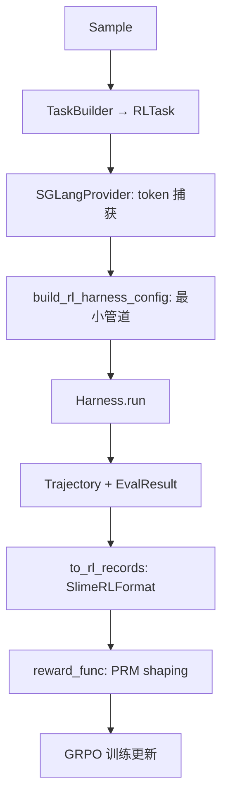

# HarnessX 沙箱 / 工具 / RL 训练

> 沙箱通过 ContextVar 透明注入，3 后端（Local/Docker/E2B）。工具系统零依赖（plain dataclass + JSON Schema）。Tracing Journal 1722 行实现崩溃安全的双轨 JSONL。SGLangProvider 实现 token 级 RL 训练桥。

## 沙箱抽象

```python
class Sandbox(ABC):
    async def exec(self, command, *, timeout, cwd, env) -> AsyncIterator[StreamChunk | ExecutionResult]: ...
    async def read_file(self, path) -> bytes: ...
    async def write_file(self, path, content: bytes) -> None: ...
    async def list_dir(self, path) -> list[FileInfo]: ...
    async def glob_files(self, pattern) -> list[str]: ...
    async def grep_files(self, pattern, path) -> list[Match]: ...
    async def kill_running(self) -> None: ...
    async def resolve(self, path) -> str: ...
```

### 3 个后端

|后端|隔离|特点|
|---|---|---|
|LocalSandbox|本地进程|asyncio subprocess + Python 文件 I/O，path-jail 检查|
|DockerSandbox|容器|docker-py exec_run，warm-pool，可选 Chromium+CDP，网络隔离|
|E2BSandbox|云 microVM|e2b AsyncSandbox，workspace 上传，pause/resume warm pool|

### ContextVar 透明注入

```python
_sandbox_ctx: ContextVar[Sandbox | None] = None

# RunLoop 每步设置
_sandbox_ctx.set(sandbox)

# 所有工具读取
def get_current_sandbox() -> Sandbox | None:
    return _sandbox_ctx.get()
```

所有文件系统工具（Bash/Read/Write/Edit/Glob/Grep/Browser）调用 `get_current_sandbox()`，有则路由，无则本地执行。切换后端无需改工具代码。

## 工具系统

```python
@dataclass
class Tool:
    name: str
    description: str
    input_schema: dict  # JSON Schema
    fn: Callable
    tags: set[str]
    execution_target: str  # 'local' | 'cloud'
```

- `@tool` 装饰器从签名推断 JSON Schema（零依赖，不用 Pydantic）
- `_DictRegistryMixin`：register 冲突检测（默认 ToolConflictError），共享于 InMemoryToolRegistry 和 MCPToolRegistry
- `_truncate_result`：>50K 字符溢出到磁盘

### 内置工具

Bash（阻止 rm -rf/ 等）、Read（text+PDF+DOCX+XLSX+CSV+PPTX）、Write、Edit、Glob、Grep、WebFetch（httpx→Playwright 升级）、WebSearch（SerpAPI→Tavily→DDGS→Bing→DDG→Wikipedia 回退链 + 断路器）、Browser（Playwright, CDP for Docker）。

### MCP 集成

`MCPClient` 全生命周期管理（connect/list_tools/call_tool/disconnect），多模态处理：
- 文本/图片/音频（≤1MB inline，更大溢出磁盘）
- `enforce_turn_budget()`：每步 200K 字符上限，溢出最大结果到磁盘

### spawn_subagent

```python
spawn_subagent(task, model, system_prompt, tools, max_steps, wait, label, share_workspace)
```

- 最大深度 3 层
- sync（wait=True）或 async（wait=False）
- 子 agent 继承父管道 + 覆盖
- 工具限制：allowed set → 新 InMemoryToolRegistry
- 叶节点剥离 spawn_subagent 工具
- Workspace 隔离（子目录或共享）
- Tracer 嵌套在父 session 下

## Tracing 系统

### HarnessJournal（1722 行）

崩溃安全的流式 JSONL 事件记录器：

**双轨消息**：
- `on_raw_event`：processor 前内容（模型/工具实际产出）
- `on_event`：delta（仅当 processor 修改了内容时写）
- `wake()` 恢复时精确重建两个轨道

**文件结构**：
- `{run_id}.jsonl` — 对话（Claude-Code 兼容格式）
- `{run_id}_trace.jsonl` — 执行元数据
- `step_state.json` — 每步崩溃安全检查点
- `sessions/{session_id}.json` — session 索引
- `tool_results/` + `media/` — 外部化大结果

**恢复**：`wake(session_id)` → 读索引 → 读 state → 从 JSONL 重建。`wake_config(session_id)` 通过 content-addressed config hash 恢复配置。

### OTelTracer

每步 span（step_id, tokens, cost_usd）+ task_end span（exit_reason, totals）。OTLP 或 Console 导出。

## Provider 抽象

```python
class BaseModelProvider(Protocol):
    async def complete(self, messages, tools, stream_callback) -> ModelResponseEvent: ...
    async def count_tokens(self, messages) -> int: ...
    async def annotate_trajectory(self, trajectory): ...  # RL hook
    def agentic(self, config) -> Harness: ...  # via AgenticMixin
```

|Provider|特点|
|---|---|
|AnthropicProvider|直接 SDK, extended thinking, prompt caching, 429 退避|
|OpenAIProvider|Chat Completions, tool_call pairing repair, 1 req/s 限速|
|ResponsesAPIProvider|Responses API, reasoning item round-trip|
|LiteLLMProvider|litellm 统一（拒绝 Anthropic 模型，不能往返 thinking 签名）|
|SGLangProvider|**RL 训练专用**，token 级捕获|

### ProviderGroup

有序 fallback 组合：
- `_ModelRuntime`：per-model 重试 + 冷却
- `_ProviderEntryRuntime`：auth 级失败跟踪
- 错误分类 → 重试策略 → 冷却 → fallback
- `AllProvidersExhaustedError(tried_models, errors)`

## SGLangProvider — RL 训练桥

> [!key-insight] SGLangProvider 是 HarnessX 与 Strands 的核心差异
> 879 行代码实现 token 级 RL 训练：增量 tokenization、flat sequence 重建、logprob 捕获、轨迹标注。

### 增量 Tokenization

- Step 0：`apply_chat_template` 全量 tokenization
- Step t+1：`known_prefix = caps[t].input_ids + caps[t].output_token_ids` + suffix tokenization
- 保证 flat sequence 不变量

### StepCapture

每轮捕获：(input_ids, output_token_ids, output_logprobs, finish_reason, inference_ms)

### build_flat_sequence

重建 (prompt_ids, response_ids, loss_mask, rollout_logprobs)：
- 模型 token loss=1，工具 token loss=0
- 截断策略：head_tail（30% 头 + 分隔 + 尾）或 hard stop

### Qwen3 XML 工具解析

`<function={"name":..., "arguments":{...}}>` 格式解析

## RL 训练管线



### ProcessRewardModel

- `NullPRM`：纯终端奖励 (±1)
- `EnhancedToolSuccessPRM`：per-step 工具成功/失败 shaping（+success_bonus/-error_penalty/-loop_penalty，有上限）
- `aggregate()`：terminal + min(bonuses, 0.3) - min(penalties, 0.5)

### 训练不变量

- `len(loss_mask) == len(rollout_logprobs) == response_length`
- `step_captures[t].input_ids == apply_chat_template(full_context_at_t)`

## Plugin 系统

- 支持 HarnessX manifest 和 Claude Code 插件格式
- 发现路径：AGENT_HOME/plugins/ → extra_paths → workspace/.harnessx/plugins/ → Claude installed_plugins.json
- 内置：RLControlPlugin（循环检测+episode metrics）、LightMemoryPlugin（文件 markdown 记忆）、McpRuntimePlugin、SkillRuntimePlugin
- ShellHookProcessor 执行插件 shell hooks

## Workspace 与 Skills

- Workspace：path-jail 强制，isolated/shared/home/readonly 模式
- Skills：SKILL.md + frontmatter，渐进式加载，SkillManager install/search/uninstall
- extensions/skills/：Anthropic 衍生技能（docx, pdf, pptx, xlsx）

## 对自研 harness 的启示

1. **ContextVar 沙箱注入**比传参更优雅——工具无需感知后端切换
2. **零依赖工具系统**（dataclass + JSON Schema）比 Pydantic 更轻量
3. **双轨 JSONL tracing**（raw + delta）是精确恢复的关键——比 Strands 的单轨更强大
4. **SGLangProvider 的增量 tokenization**是 RL 训练的核心技术——保证 flat sequence 不变量
5. **ProviderGroup 有序 fallback**比单 provider 更健壮
6. **MCP 多模态处理**（inline/disk spillover）是生产级细节
7. **spawn_subagent 的深度限制和工具限制**是安全的多 agent 模式

## 参考

- 源码: harnessx/sandbox/, harnessx/tools/, harnessx/tracing/
- 源码: harnessx/providers/ (sglang.py 35KB), harnessx/plugins/
- 源码: harnessx/workspace/, extensions/
- [[harnessx]] — 源摘要
- [[strands-sandbox-safety]] — Strands 沙箱对比
- [[strands-tool-system]] — Strands 工具系统对比
