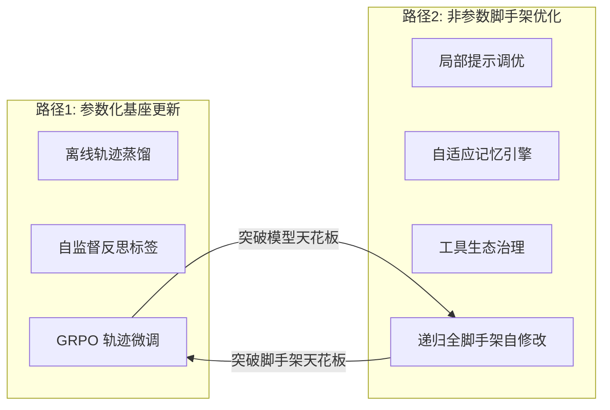

# Self-Improvements in Modern Agentic Systems: A Survey

> **论文类型**：综述（97 页预印本）
> **arXiv**：https://arxiv.org/abs/2607.13104
> **项目主页**：https://selfimproving-agent.github.io/
> **作者**：Zhe Ren, Yimeng Chen, Dandan Guo 等（吉林大学 + KAUST + Alberta）
> **通讯**：Jürgen Schmidhuber（哥德尔机/递归自改进理论奠基人）

## 核心思想

现代智能体系统具备**二元组件结构**：参数化基座模型 $M$ + 非参数运行脚手架 $\Sigma$（Harness）。自提升是一类闭环算法，在极低人工干预下自主将任务执行经验转化为可持续能力增益。

$$A = (M, \Sigma), \quad \Sigma = (P, S)$$

- $M$：参数化基座 LLM（权重可训练）
- $\Sigma$：非参数脚手架（提示词、内存、工具、控制流，离散可编辑）
- $P$：8 类生命周期钩子→处理器映射表
- $S$：全局共享资源池（工具注册表、沙箱、日志、插件）

### 自诱导更新算子

$$(M_{t+1}, \Sigma_{t+1}) = \mathcal{U}(M_t, \Sigma_t, \mathcal{T}_t, R_t, \mathcal{R}_t)$$

三类驱动信号：
1. $\mathcal{T}_t$ — 全链路执行轨迹库
2. $R_t$ — 标量任务评估奖励
3. $\mathcal{R}_t$ — 自我反思诊断文本

## 两条正交优化路径

### 路径 1：参数化基座更新（固定 $\Sigma$，修改 $M$）

| 子方向 | 机制 | 代表工作 |
|--------|------|----------|
| 离线轨迹蒸馏 | 批量任务轨迹→监督/偏好样本→微调 | SWE-agent 离线微调、WebShop 蒸馏 |
| 自监督反思标签 | 自我评判打分排序→对比损失 | Self-Rewarding、Self-Refine |
| GRPO 轨迹微调 | 跨框架组内相对优势 + KL 约束裁剪 PPO | GRPO、HarnessX 协同演化 |

> [!key-insight] 跨框架 GRPO
> 同一任务 $x$ 所有轨迹归为分组 $\mathcal{G}_x$，天然包含多脚手架策略差异。组内相对优势：
> $$\hat{A}(\tau_i) = \frac{r_i - \mu(\mathcal{G}_x)}{\sigma(\mathcal{G}_x) + \epsilon}$$
> 混合回放缓冲区缓存旧模型 logprobs 消除离线策略偏差。

**优势**：优化细粒度推理行为，长期稳定，无运行时开销。
**局限**：**训练信号天花板**——固定脚手架限制策略空间。

### 路径 2：非参数脚手架优化（固定 $M$，编辑 $\Sigma$）

| 子方向 | 优化维度 | 代表工作 |
|--------|----------|----------|
| 局部提示调优 | D2 上下文组装 | TextGrad、APE、OPRO、Promptbreeder |
| 自适应记忆 | D3 内存管理 | Memento、MIA、MemGPT |
| 工具生态治理 | D4 工具生态 | 动态启用/禁用、复合工具封装 |
| 递归全脚手架自修改 | 全九维 | **AEGIS 引擎 / HarnessX** |

> [!note] AEGIS 四阶段流水线
> 1. **Digester**：千万 token 轨迹→结构化故障摘要
> 2. **Planner**：强制探索未尝试的结构性修改
> 3. **Evolver**：输出类型安全候选脚手架 + 冒烟测试
> 4. **Critic + Seesaw Gate**：拦截奖励欺骗，历史任务不退化
>
> 详见 [[harnessx-aegis-evolution]]。

**优势**：突破模型策略天花板，快速修复流程缺陷，迭代成本低。
**局限**：**脚手架天花板**——基座推理能力不足时无法完成复杂任务。

## 九维脚手架行为分类

| 维度 | 控制 | 对应 HarnessX 组件 |
|------|------|-------------------|
| D1 模型路由 | 推理/评判模型分配 | ModelConfig |
| D2 上下文组装 | 模型输入构造 | processors/context/ |
| D3 持久内存 | 跨步骤/会话记忆 | processors/memory/ |
| D4 工具生态 | 工具集、调用校验 | processors/tools/ |
| D5 执行环境 | 沙箱、容器隔离 | sandbox/ |
| D6 奖励评估 | 任务成功判定 | processors/evaluation/ |
| D7 安全控制 | 循环拦截、成本约束 | processors/control/ |
| D8 可观测日志 | 轨迹存储（自提升数据源） | tracing/ |
| D9 训练桥 | 轨迹→RL 样本 | rl/ |

> [!tip] 与 HarnessX 的对应
> 综述的九维分类直接来自 HarnessX 的实现。参见 [[harnessx-framework-composition]] 和 [[harnessx-sandbox-tools-rl]]。

## 三大失效模式与缓解

| 失效模式 | 现象 | 缓解方案 |
|----------|------|----------|
| **奖励欺骗** | 脚手架拟合验证器格式，不完成真实任务 | Critic 分层校验轨迹真实性；多维度验证器联合打分 |
| **灾难性遗忘** | 优化某类任务破坏其他已稳定任务 | Seesaw 硬性闸门；多变体集成路由隔离 |
| **探索不足** | 仅微调提示词，拒绝结构性重构 | Planner 强制生成结构性优化方向 |

> [!warning] Seesaw 约束
> 任何脚手架修改不得降低历史已解决任务的通过率。HarnessX 中实现为对比历史最佳（非上一轮），容差不能漂移。详见 [[harnessx-aegis-evolution]]。

## 六大落地场景

| 场景 | 特点 | 最优架构 | 代表基准 |
|------|------|----------|----------|
| 软件工程 | 反馈密集、自动验证 | 协同演化（GRPO + AEGIS） | SWE-bench Verified |
| Web 浏览器 | 长链式、稀疏奖励 | 多变体隔离脚手架 | WebShop |
| 博弈与逻辑 | 规则明确、二元判定 | 仅脚手架优化 | ALFWorld |
| 科学实验 | 全链路、高成本 | 离线轨迹蒸馏 | — |
| 具身机器人 | 虚实域鸿沟、连续动作 | 脚手架 + 具身 RL | — |
| 操作系统调度 | 跨软件、安全约束 | 多层安全闸门 | — |

## 四大未来研究方向

1. **在线测试时脚手架自适应** — 实时更新规则，无需离线批量迭代
2. **主动高价值故障探索** — Agent 主动设计高难度测试任务采集稀缺样本
3. **快慢思考蒸馏** — 脚手架慢推理策略→模型权重，在线推理降开销
4. **分布式多智能体协同演化** — 共享回放缓冲区，互相迭代对方脚手架与模型

## 核心实验结论

- 5 基准 × 3 模型，15 组中 14 组正向提升，**平均 +14.5%**
- **逆缩放效应**：基座越弱收益越大（ALFWorld Qwen3.5-9B +44.0%）
- **协同演化额外 +4.7%** 增益（一次采样同时供给两条路径）
- 变体隔离路由：GAIA 异构任务 +13.6%，算力降 25%

## 对 Agent Harness 的启发

1. **二元架构是自提升的基础**：将 harness 视为与模型对等的一等公民组件，而非附属配置。参见 [[harnessx]]。
2. **两条路径互补**：单独优化任一路径都有天花板，协同演化是突破的关键。
3. **九维分类提供了 harness 组件设计的标准 checklist**：每个维度都应有可独立替换、可演化的接口。
4. **Seesaw 闸门是生产安全的底线**：任何自修改系统都必须有历史性能不退化的硬约束。
5. **GRPO 跨框架组内优势**：不同 harness 变体产生的轨迹天然构成策略多样性来源——这是 [[harnessx-sandbox-tools-rl]] 中 SGLangProvider 的理论依据。
6. **AEGIS 四阶段（LLM 生成 + 确定性闸门）**是当前最成熟的递归自修改架构。参见 [[harnessx-aegis-evolution]]。

## 关联笔记

- [[harnessx]] — HarnessX 源摘要（本综述的核心工程实例）
- [[harnessx-aegis-evolution]] — AEGIS 演化引擎详解
- [[harnessx-framework-composition]] — 九维分类的工程实现
- [[harnessx-sandbox-tools-rl]] — SGLangProvider GRPO 训练桥
- [[harnessx-benchmark-evaluation]] — 5 基准适配器
- [[reflexion]] — 自我改进型 Agent 的早期代表
- [[survey-llm-based-autonomous-agents]] — LLM Agent 通用综述

## 局限与待验证

- MDP 映射仅为工程设计指南，无严格收敛证明；符号动作空间无限，存在过拟合风险。
- 实验仅覆盖文本离散动作智能体，连续控制具身机器人未深入。
- AEGIS 元 Agent 依赖强能力闭源大模型，开源轻量元 Agent 效果未验证。
- 基准数据集规模有限，工业超大规模场景泛化性待验证。
