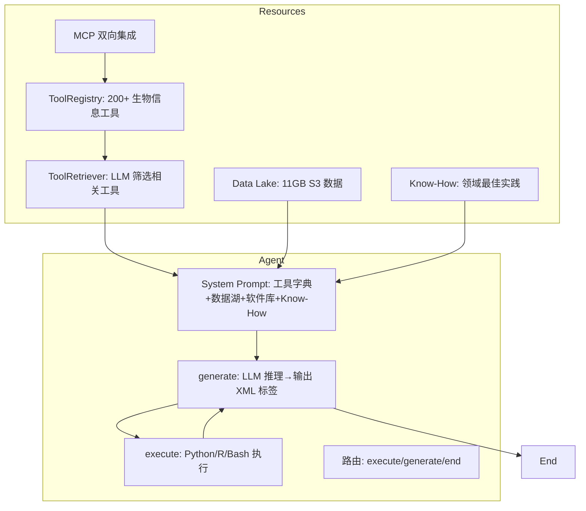

# Biomni — 生物医学 AI Agent

> Stanford SNAP 实验室开源的通用生物医学 AI Agent。基于 LangGraph + Code-Act 范式，通过 LLM 生成代码调用生物信息工具库，覆盖基因/蛋白质/通路/疾病全链条分析。

## 基本信息

- **仓库**: /Users/hhl/Documents/projs/Biomni
- **定位**: 通用生物医学研究 Agent
- **来源**: Stanford University (snap-stanford)
- **论文**: bioRxiv 2025.05.30.656746
- **许可**: Apache 2.0（部分工具有额外限制）
- **Web UI**: biomni.stanford.edu

## 核心架构



## Agent 循环：Code-Act + XML 标签

> [!note] 不用 function calling，用 XML 标签 + 代码执行
> Biomni 不走 OpenAI function-calling 路线。LLM 输出包含三种 XML 标签：
> - `<execute>code</execute>` — 执行 Python/R/Bash 代码
> - `<solution>answer</solution>` — 提交最终答案
> - `<observation>output</observation>` — 执行结果自动注入

### LangGraph 状态机

```python
class AgentState(TypedDict):
    messages: list[BaseMessage]
    next_step: str | None  # "execute" | "generate" | "end"

# 三节点循环
workflow = StateGraph(AgentState)
workflow.add_node("generate", generate)   # LLM 推理
workflow.add_node("execute", execute)     # 代码执行
workflow.add_edge("execute", "generate")  # 执行→再推理
workflow.add_edge(START, "generate")
# generate 节点根据输出标签路由
```

### 多语言代码执行

```python
# Python（默认）
<execute> result = understand_scRNA(data) print(result) </execute>

# R 代码
<execute> #!R\nlibrary(ggplot2)\nprint("Hello from R") </execute>

# Bash / CLI 工具
<execute> #!BASH\necho "Hello"\nls -la </execute>
<execute> #!CLI\samtools view -bS input.sam > output.bam </execute>
```

执行有超时保护（默认 600s），输出超 10K 字符截断。

### 自批评模式

```python
# 可选：在 solution 前插入自我批评节点
agent.configure(self_critic=True, test_time_scale_round=2)
# generate → execute → generate → ... → solution → self_critic → generate(改进) → ...
```

## 工具系统

### 声明式工具描述

```python
# biomni/tool/tool_description/database.py
description = [{
    "name": "query_uniprot",
    "description": "Query the UniProt REST API using natural language or direct endpoint.",
    "required_parameters": [{"name": "prompt", "type": "str", "description": "..."}],
    "optional_parameters": [{"name": "max_results", "type": "int", "default": 5, ...}],
}]
```

18 个领域分类（biochemistry / cancer_biology / genetics / immunology ...），200+ 工具。工具描述与实现分离，支持动态注册和校验。

### ToolRegistry

```python
class ToolRegistry:
    # 注册时校验必需字段
    required_keys = ["name", "description", "required_parameters"]
    # 按 ID/名称查找、增删、pickle 持久化
```

### 动态工具添加

```python
agent.add_tool(my_function)  # 用 LLM 从源码自动生成 API schema
agent.add_data({"expr.csv": "Gene expression data"})  # 添加数据
agent.add_software({"my_pkg": "Custom analysis package"})  # 添加软件
```

## 工具检索（ToolRetriever）

> [!key-insight] LLM-as-Retriever：不用向量检索
> 不是 embedding + 向量相似度，而是把所有工具/数据/库的名称+描述列表喂给 LLM，让 LLM 输出相关索引。

```python
class ToolRetriever:
    def prompt_based_retrieval(self, query, resources, llm):
        # 构建提示：列出所有工具/数据/库的名称+描述
        # LLM 输出: TOOLS: [0, 3, 5]  DATA_LAKE: [1, 2]  LIBRARIES: [0, 4]
        # 返回筛选后的子集
```

4 类资源同时检索：tools / data_lake / libraries / know_how。检索后动态更新 system prompt，只暴露相关工具给 LLM。

## Know-How 库

```python
class KnowHowLoader:
    # 加载 markdown 文档，自动提取 frontmatter metadata
    # 商业模式过滤：commercial_mode=True 时排除非商用文档
    # 全文注入 system prompt（非按需检索）
```

- 文档结构：YAML frontmatter（作者/许可/商用权限）+ markdown 正文
- 初始配置时全部加载到 system prompt
- 工具检索时按需筛选相关文档

## Gradio UI 设计

> [!tip] 双窗口设计：主对话 + 执行日志
> Biomni 的 Gradio UI 采用左右双栏布局，这是值得借鉴的 Agent UI 模式。

```python
with gr.Blocks() as demo:
    with gr.Row():
        # 左栏：用户对话（最终答案）
        main_chatbot = gr.Chatbot(label="Biomni A1 Agent", type="messages", height=800)
        # 右栏：执行过程（推理/代码/观察）
        innerloop_chatbot = gr.Chatbot(label="Biomni Executor", type="messages", height=800)
    
    with gr.Row():
        # 多模态输入（文本+文件上传）
        prompt_input = gr.MultimodalTextbox(file_count="multiple")
```

### 消息类型映射

| LLM 输出标签 | Gradio 消息 metadata | 说明 |
|-------------|---------------------|------|
| thinking 文本 | `{"title": "🤔 Reasoning"}` | 推理过程 |
| `<execute>` | `{"title": "🛠️ Executing code...", "status": "pending"}` | 代码执行中 |
| `<observation>` | `{"status": "done", "collapsed": True}` | 执行结果（可折叠） |
| `<solution>` | `{"title": "✅ Answer"}` | 最终答案 |
| 文件路径 | `{"title": "📁 Files"}` / `gr.Image()` | 自动识别图片/PDF |

### 关键 UI 特性

1. **流式输出**：`generate_response` 是 generator，每步 yield 更新双栏
2. **文件预览**：observation 中正则匹配 `.png/.jpg/.pdf` 路径，自动渲染
3. **访问控制**：`require_verification=True` 时显示密码页（默认 `Biomni2025`）
4. **代码高亮**：`##### Code: \n```python\n{code}\n````  markdown 渲染
5. **图片捕获**：matplotlib 图表在代码执行时自动捕获为 base64
6. **点赞反馈**：`main_chatbot.like(like)` 收集用户反馈

## MCP 双向集成

### 消费外部 MCP

```python
agent.add_mcp(config_path="./mcp_config.yaml")
# 自动发现工具 → 创建同步 wrapper → 注册到 tool_registry
```

支持 Docker / npx / Python / 二进制 4 种 server 启动方式。`${ENV_VAR}` 环境变量替换。

### 暴露为 MCP Server

```python
mcp = agent.create_mcp_server(tool_modules=["biomni.tool.database"])
mcp.run(transport="stdio")
# 内部工具自动包装为 MCP tool，参数校验 + 类型映射
```

## 配置管理

```python
@dataclass
class BiomniConfig:
    path: str = "./data"
    timeout_seconds: int = 600
    llm: str = "claude-sonnet-4-5"
    use_tool_retriever: bool = True
    commercial_mode: bool = False
    source: str | None = None  # auto-detect from model name
    # 环境变量覆盖 + 全局单例

default_config.llm = "gpt-4"  # 全局修改
```

8 个 LLM 源：OpenAI / AzureOpenAI / Anthropic / Ollama / Gemini / Bedrock / Groq / Custom。

## PDF 报告生成

```python
agent.save_conversation_history("report.pdf")
# 1. 从 conversation_state 或 log 生成 markdown
# 2. 步骤编号 + 代码块 + 观察结果 + 图片
# 3. WeasyPrint / markdown2pdf / Pandoc 三选一转 PDF
# 4. 60 秒超时保护
```

## 对自研 Harness 的 UI 启示

> [!key-insight] 以下设计模式可直接用于自研 harness 的用户界面

1. **双栏布局**：主对话（用户视角）+ 执行日志（开发者视角）——分离关注点
2. **XML 标签路由**：比 function calling 更透明、可调试，且不依赖特定 LLM 的 function-calling 实现
3. **LLM-as-Retriever**：工具数量 <500 时，prompt-based 检索比向量检索更简单且效果不差
4. **Know-How 全注入**：领域知识文档直接放入 system prompt，确保 LLM 一定能看到
5. **多语言代码执行**：`#!R` / `#!BASH` / `#!CLI` 标记前缀——简洁的多语言分发
6. **文件自动预览**：observation 中正则匹配文件路径，自动渲染图片/PDF
7. **流式双栏更新**：generator yield 每步同时更新主对话和执行日志
8. **可折叠观察结果**：长输出默认折叠，降低视觉噪音
9. **访问控制层**：`require_verification` 是最简部署级访问控制
10. **PDF 导出**：对话历史→markdown→PDF，60s 超时——可复用的报告生成模式

## 与其他框架对比

| 特性 | Biomni | Strands | HarnessX |
|------|--------|---------|----------|
| Agent 循环 | LangGraph 状态机 + XML 标签 | async generator + hooks | run_loop + 8 钩子 Processor |
| 工具调用 | Code-Act（生成代码调函数） | function calling | function calling |
| 工具检索 | LLM-as-Retriever（prompt 筛选） | 无内置 | 无内置 |
| UI | Gradio 双栏 | 无 | Lab UI |
| MCP | 双向（消费+暴露） | 消费 | 消费 |
| 沙箱 | 无（全系统权限） | Docker/SSH/Local | Local/Docker/E2B |
| 自演化 | 无 | 无 | AEGIS 引擎 |
| 领域 | 生物医学专用 | 通用 | 通用 |

> [!warning] 安全风险
> Biomni 执行 LLM 生成代码时有**全系统权限**，无沙箱隔离。README 明确警告生产环境需隔离。这是自研 harness 需要改进的点——参见 [[harnessx-sandbox-tools-rl]] 的 ContextVar 沙箱注入。

## 关联笔记

- [[harnessx]] — HarnessX 框架组合机制
- [[harnessx-sandbox-tools-rl]] — 沙箱/工具/RL（对比安全模型）
- [[strands-tool-system]] — Strands 工具系统（对比工具设计）
- [[strands-agent-loop]] — Strands Agent Loop（对比循环设计）
- [[hao-jianye-harness-determines-upper-bound]] — Harness 决定能力上限
