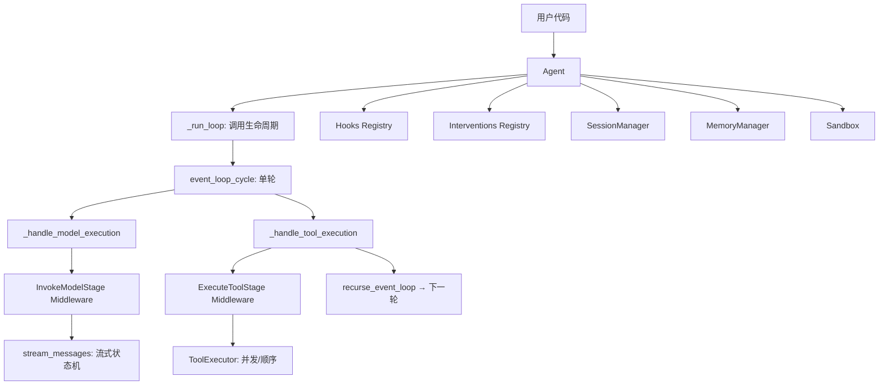

# Strands Agents SDK

> 开源 AI Agent SDK（Python + TypeScript），提供 Agent Loop、多模型接入、工具系统、MCP 集成、Hooks/Middleware/Interventions 三层扩展、多 Agent 编排、沙箱、会话与记忆、可观测性等完整能力。

## 基本信息

- **仓库**: strands-agents/harness-sdk
- **License**: Apache-2.0
- **主要语言**: Python (strands-py) + TypeScript (strands-ts)
- **组件**: strands-py（Python SDK）、strands-ts（TypeScript SDK）、strands-mcp（MCP Server）、site（文档站）、team（设计文档）
- **安装**: `pip install strands-agents strands-agents-tools` / `npm install @strands-agents/sdk`
- **默认 Provider**: Amazon Bedrock（需 AWS 凭据），可切换 Anthropic / OpenAI / Gemini / Ollama / LiteLLM 等

## 核心架构



## 子系统概览

|子系统|说明|详细笔记|
|---|---|---|
|Agent Loop|递归 async generator 实现的 ReAct 循环|[[strands-agent-loop]]|
|Model Provider|ABC + 13 个 provider，Bedrock-modeled StreamEvent 统一格式|[[strands-model-providers]]|
|Tool System|@tool 装饰器 → Pydantic → JSON Schema；ToolRegistry + 热重载 + MCP|[[strands-tool-system]]|
|Hooks / Middleware / Interventions|三层扩展：事件回调 / 流式管道 / 类型化决策|[[strands-hooks-middleware]]|
|Multi-Agent / Session / Memory|Graph/Swarm/A2A 编排 + 会话持久化 + 跨会话记忆|[[strands-multi-agent-session]]|
|Sandbox / Telemetry / Safety|Docker/SSH/本地沙箱 + OTel 可观测 + Guardrails + Cedar 策略|[[strands-sandbox-safety]]|

## 设计原则（团队 Tenets）

1. **Simple at any scale** — 简单的事应该简单；同一套抽象从原型到生产
2. **Extensible by design** — 尽可能多的扩展点（hooks、providers、tools 等）
3. **Composability** — 各子系统互为积木，一致且互补
4. **The obvious path is the happy path** — 直觉命名 + 有用错误信息
5. **Accessible to humans and agents** — 人和 AI 都能理解
6. **Embrace common standards** — 不重复造轮子

## 关键架构决策（ADR 摘要）

- **Hooks 是低级原语**：高级抽象（如 RetryStrategy）应建在 hooks 之上，而非只暴露 HookProvider
- **扁平命名空间**：公共 API 从顶层导出，不要求深层导入
- **同时提供低级和高级 API**：低级 API 给高级用户，高级 API 用合理默认值引导
- **使用 LLM 原生单位**：API 参数用 token 数而非字符数
- **避免重载领域术语**：如用 'agent loop' 而非 'event loop'（避免与 asyncio 混淆）
- **Pay for play**：选择性破坏性变更可接受（不使用新功能的代码不受影响）

## 快速示例

```python
from strands import Agent, tool
from strands_tools import calculator

@tool
def word_count(text: str) -> int:
    """Count words in text."""
    return len(text.split())

agent = Agent(tools=[calculator, word_count])
response = agent("How many words are in 'hello world'?")
```

## 参考

- 仓库源码: /Users/hhl/Documents/projs/harness-sdk (本地克隆)
- 文档站: https://strandsagents.com/
- 设计文档: team/TENETS.md, team/DECISIONS.md, team/AGENT_GUIDELINES.md, team/API_BAR_RAISING.md, team/COMPATIBILITY.md
