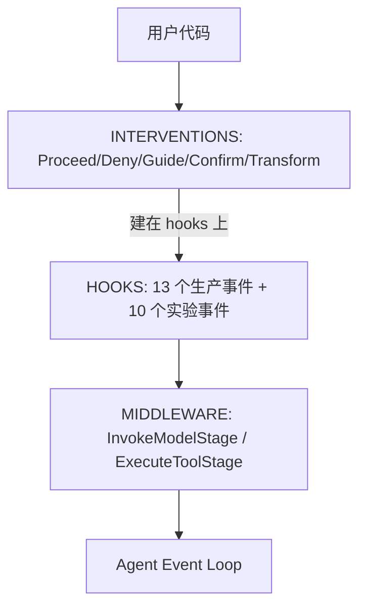

# Strands Hooks / Middleware / Interventions 三层扩展

> Strands SDK 提供三个互补的扩展层，各自在不同抽象级别工作：Hooks（类型化事件回调）、Middleware（流式管道，内部 API）、Interventions（类型化决策，建在 Hooks 之上）。

## 三层架构



## 1. Hooks 系统

### 事件类型（13 个生产事件）

**单 Agent 事件**：
|事件|触发时机|可写字段|逆序?|可中断?|
|---|---|---|---|---|
|AgentInitializedEvent|Agent 构造后|无|否|否|
|BeforeInvocationEvent|`__call__` 开始|messages, cancel|否|否|
|AfterInvocationEvent|调用结束|resume|是|否|
|MessageAddedEvent|消息追加|无|否|否|
|BeforeToolCallEvent|工具执行前|cancel_tool, selected_tool, tool_use|否|是|
|AfterToolCallEvent|工具完成后|result, retry|是|否|
|BeforeModelCallEvent|模型推理前|cancel|否|否|
|AfterModelCallEvent|模型完成后|retry|是|否|

**多 Agent 事件**：MultiAgentInitializedEvent, BeforeMultiAgentInvocationEvent, AfterMultiAgentInvocationEvent, BeforeNodeCallEvent, AfterNodeCallEvent。

### 注册与优先级

```python
registry.add_callback(EventType, callback, *, order=HookOrder.DEFAULT)
registry.add_hook(HookProvider())  # 批量注册
```

优先级常量：`SDK_FIRST=-100`, `INTERVENTION_OUTPUT=-90`, `DEFAULT=0`, `INTERVENTION_INPUT=90`, `SDK_LAST=100`。用 `bisect.insort` 排序，同优先级保持注册顺序。after 事件在优先级组内逆序。

### 能力

- **取消**：`cancel` / `cancel_tool` 标志
- **重试**：`AfterToolCallEvent.retry` / `AfterModelCallEvent.retry`
- **修改**：`tool_use`（参数）、`selected_tool`（换工具）、`result`（结果）、`messages`（输入）
- **中断**：`event.interrupt()` on `_Interruptible` 事件 → HITL 暂停/恢复
- **自动循环**：`AfterInvocationEvent.resume` → 用新输入重新调用
- 事件是 frozen dataclass，只有 `_can_write()` 白名单字段可设

## 2. Middleware 管道（内部 API）

> [!warning] _middleware/ 包不是公共 API
> 内部消费者通过 `agent._middleware_registry.add_middleware(...)` 访问。公开时需添加类型化的 overload。

### 两个 Stage

1. **InvokeModelStage** — 包装 `model.stream()`。Context: `InvokeModelContext`（agent, messages, system_prompt, tool_specs, tool_choice, invocation_state, model）
2. **ExecuteToolStage** — 包装 `tool.stream()`。Context: `ExecuteToolContext`（agent, tool, tool_use, invocation_state, _interrupt_state）。支持 `context.interrupt()` 发起 HITL

### 三个阶段（每个 Stage）

1. **Input** — 执行前转换 context。`async def handler(context) -> Context`
2. **Wrap** — 完整 async generator 包装。`async def handler(context, next_fn) -> AsyncGenerator[event]`。可短路、注入事件、重试
3. **Output** — 执行后转换结果。`def handler(result: MiddlewareResult) -> MiddlewareResult`。仅处理最后一个（结果）事件

### 关键设计

- **结果编码**：最后一个 yield 的事件就是结果（Python async generator 不能 return 值）
- **防御性深拷贝**：context 的 messages/system_prompt/tool_specs/tool_choice 深拷贝；invocation_state 和 model 共享引用；model_state 完全排除
- **零开销快速路径**：无 handler 注册时直接返回 terminal
- **Hook 重试会重建 middleware 链**：N 次 hook 重试 = N 次 middleware 运行
- **Middleware 重试对 hooks 不可见**：N 次 `next_fn` 调用 = 一对 hook

> [!warning] except Exception 会吞掉中断
> `InterruptException` 继承 `Exception`（不是 `BaseException`）。在 middleware 中用 `try/except Exception` 包裹 `next_fn` 或 `interrupt()` 会静默捕获中断，将 HITL 暂停变成捕获错误。需重新抛出 `InterruptException`。

### 内置消费者

- Agentic context manager：`InvokeModelStage.Input` 展示 token 用量
- Memory manager：`InvokeModelStage.Input` 注入检索到的记忆
- Context injector plugin：`InvokeModelStage.Input` 注入消息

## 3. Interventions 系统

建在 hooks 之上的高层抽象，提供类型化决策语义。

### 五种 Action

|Action|语义|before_tool_call|before_model_call|after_tool_call|after_model_call|
|---|---|:---:|:---:|:---:|:---:|
|Proceed|允许不变|✓|✓|✓|✓|
|Deny|阻止（原因→模型）|✓|✓|—|—|
|Guide|引导（cancel+feedback / inject+retry）|✓|✓|—|✓|
|Confirm|人工审批（interrupt）|✓|—|—|—|
|Transform|原地修改|✓|✓|✓|✓|

### Handler 基类

```python
class InterventionHandler(ABC):
    @property
    @abstractmethod
    def name(self) -> str: ...
    # 可覆盖的生命周期方法（sync 或 async）
    def before_tool_call(self, agent, tool_use) -> InterventionAction: ...
    def after_model_call(self, agent, message, stop_reason) -> InterventionAction: ...
    # ...
    @property
    def on_error(self) -> str: return 'throw'  # 'throw' | 'proceed' | 'deny'
```

### 调度

- Before 事件注册在 `INTERVENTION_INPUT`（order=90，在用户 hooks 之后）
- After 事件注册在 `INTERVENTION_OUTPUT`（order=-90，在用户 hooks 之前）
- **短路**：Deny 立即返回，跳过剩余 handler
- **Guide 累积**：多个 Guide 跨 handler 累积，feedback 用 `\n` 连接，不短路
- **Transform** 立即应用，不短路（后续 handler 看到转换后的事件）

## 三层对比

|维度|Hooks|Middleware|Interventions|
|---|---|---|---|
|抽象|事件回调|流式管道|类型化决策|
|基于|直接注册|直接注册|建在 hooks 上|
|组合|优先级排序，独立|链（嵌套 generator）|注册序，短路 + 累积|
|取消|标志（cancel/cancel_tool）|短路 yield|Action（Deny/Confirm）|
|流式可见性|仅 before/after|包装整个执行，可见每个事件|不可见|
|API 状态|公开|内部|公开|

## 内置 Intervention Handler

### CedarAuthorization

基于 Cedar 策略的访问控制，在每个 tool call 前评估：
- 工具名 → Cedar action，工具输入 → context.input
- 支持 static principal 或 dynamic principal_resolver
- 从 MCP 工具定义自动生成 Cedar schema
- 调用计数持久化到 `agent.state`（支持限速策略）
- 失败闭口（Deny）

### HumanInTheLoop

三种响应收集模式：
1. **默认（无 ask）**：返回 Confirm → 框架调 `event.interrupt()` → agent 暂停 → 调用方恢复
2. **ask='stdio'**：CLI 内联提示，`input()` 在工作线程中执行
3. **自定义 ask callable**：同步或异步函数（如 Slack DM、Web UI）

工具允许列表：`['*']`（全部）、`['read_file', 'list_dir']`（白名单）、`['*', '!delete_file']`（排除）。

## Guardrails

> [!note] Guardrails 是类型定义，不是运行时执行系统
> `types/guardrails.py` 定义 Bedrock Guardrails API 兼容的 TypedDict（TopicPolicy、ContentPolicy、SensitiveInformationPolicy 等）。执行在 Bedrock API 层面，不在 Strands 中。自定义策略执行用 Intervention 系统。

## 对 llm-harness-runtime 的启示

1. **三层分离**清晰：Hooks 观察生命周期、Middleware 包装流式执行、Interventions 做类型化决策
2. **Hook 优先级 + 逆序 after 事件**是成熟的回调调度模式
3. **Middleware 的 Input/Wrap/Output 三阶段**比单纯 before/after 更强大——能转换流式事件
4. **Intervention 的 Guide 累积**允许多个安全检查叠加反馈
5. **on_error 策略**（throw/proceed/deny）是安全系统的重要配置点
6. **DECISIONS.md 明确**：Hooks 是低级原语，高级抽象应建在其上而非直接暴露

## 参考

- 源码: strands-py/src/strands/hooks/events.py (15.5KB, 全部事件类型)
- 源码: strands-py/src/strands/hooks/registry.py (16KB, HookRegistry)
- 源码: strands-py/src/strands/_middleware/README.md (10.7KB, 设计规范)
- 源码: strands-py/src/strands/interventions/ (actions, handler, registry)
- 源码: strands-py/src/strands/vended_interventions/ (cedar, hitl)
- [[strands-agents-sdk]] — 源摘要
- [[hook-system]] — 通用 Hook 系统设计
- [[permission-model]] — 权限模型
