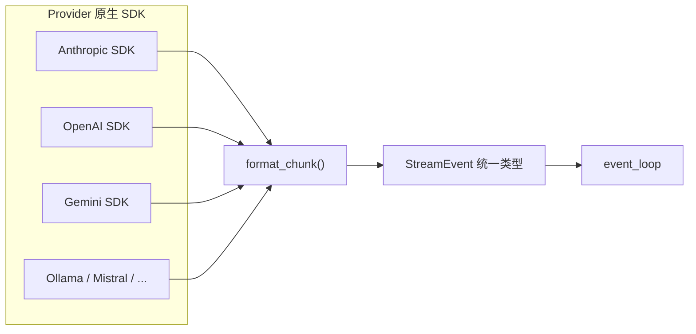
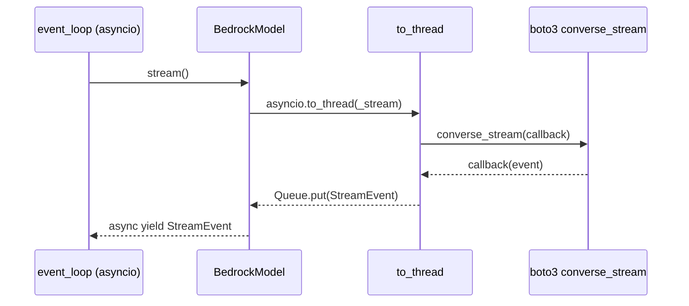

# Strands 多模型 Provider 抽象

> 13 个模型 provider 通过一个 ABC（4 个抽象方法 + 3 个可覆盖成员）接入，所有 provider 将原生 SDK 事件翻译为统一的 Bedrock-modeled StreamEvent，使 event_loop 不感知具体 provider。

Strands 的多模型支持采用**最小接口 + 翻译层**策略：定义一个极简的 `Model` 抽象基类，所有 provider 实现同一组抽象方法，但各自将原生 SDK 的请求/响应格式翻译为统一的 `StreamEvent` 类型。这种设计让 [[strands-agent-loop|Agent Loop]] 完全与具体 provider 解耦——event_loop 只消费 `StreamEvent`，不关心底层是 Bedrock、OpenAI 还是 Gemini。

## Model ABC 接口

```python
class Model(abc.ABC):
    # 可覆盖属性
    @property
    def stateful(self) -> bool: return False
    @property
    def context_window_limit(self) -> int | None: ...

    # 抽象方法（必须实现）
    @abc.abstractmethod
    def update_config(self, **model_config) -> None: ...
    @abc.abstractmethod
    def get_config(self) -> Any: ...
    @abc.abstractmethod
    def structured_output(self, output_model, prompt, system_prompt, **kwargs) -> AsyncGenerator[dict, None]: ...
    @abc.abstractmethod
    def stream(self, messages, tool_specs, system_prompt, *, tool_choice, system_prompt_content, invocation_state, **kwargs) -> AsyncIterable[StreamEvent]: ...

    # 可覆盖异步方法
    async def count_tokens(self, messages, tool_specs, system_prompt, system_prompt_content) -> int: ...  # 启发式回退
```

> [!note] 接口极小：4 个抽象方法
> 统一类型（`StreamEvent`、`ContentBlock`、`ToolSpec`）足够丰富以表达所有 provider 的能力，provider-specific 特性封装在各 provider 的 config TypedDict 和 `format_request` 内部。`get_config() -> Any` 刻意不标注返回类型——每个 provider 返回自己的 config TypedDict，event_loop 只读 `context_window_limit`。

## 统一类型：Bedrock-modeled

所有流式事件使用 `StreamEvent` TypedDict，**以 Bedrock API 为模型**。类型定义位于 `types/streaming.py`、`types/content.py`、`types/tools.py`，文档注释明确标注 "modeled after the Bedrock API"。

核心事件类型：

- `messageStart` / `contentBlockStart` / `contentBlockDelta` / `contentBlockStop` / `messageStop` / `metadata` / `redactContent`
- `ContentBlockDelta` 支持 `text`、`toolUse`（input 片段）、`reasoningContent`、`citation`



这意味着 Bedrock provider 是**零翻译基线**，其他 provider 支付翻译税。每个非 Bedrock provider 通过 `format_chunk()`（或 `_format_chunk()`）方法将原生事件转换为 `StreamEvent`。`BedrockModel` 因此成为参考实现（1323 行），其 `_stream` 直接使用 boto3 的 `converse_stream` 输出。

## Provider 列表

| Provider | 基类 | 客户端 | 原生 Token 计数 |
|---|---|---|---|
| BedrockModel | Model | boto3（同步，线程桥接） | ✅ CountTokens API |
| AnthropicModel | Model | anthropic.AsyncAnthropic | ✅ count_tokens |
| OpenAIModel | Model | openai.AsyncOpenAI | ❌ 启发式 |
| OpenAIResponsesModel | Model | openai.AsyncOpenAI | ✅ input_tokens.count |
| GeminiModel | Model | google.genai.Client | ✅ count_tokens |
| OllamaModel | Model | ollama | ❌ 启发式 |
| LiteLLMModel | **OpenAIModel** | litellm | ❌ 启发式 |
| MistralModel | Model | mistralai.Mistral | ❌ 启发式 |
| WriterModel | Model | writerai.AsyncClient | ❌ 启发式 |
| SageMakerAIModel | **OpenAIModel** | boto3 SageMaker Runtime | ❌ 启发式 |
| LlamaCppModel | Model | httpx | ❌ 启发式 |
| LlamaAPIModel | Model | llama_api_client | ❌ 启发式 |

所有 provider 在 `models/__init__.py` 中通过 `__getattr__` 实现 **lazy loading**，避免可选依赖（如 `anthropic`、`google-genai`）的导入开销——只有实际使用的 provider 才会触发对应 SDK 的导入。

## Provider-Specific 特性隔离

三种机制防止特性泄漏到 ABC，保证接口长期稳定：

1. **Provider-specific config TypedDict**：如 `BedrockConfig` 有 `guardrail_id`、`cache_config`、`strict_tools` 等 ~25 个字段，但 `get_config() -> Any` 返回 provider 特定类型，event_loop 只读 `context_window_limit`。基础配置 `BaseModelConfig` 仅含 `{context_window_limit: int | None}`。
2. **`params: dict[str, Any]` 透传**：OpenAI、Anthropic、Gemini、LiteLLM、LlamaCpp 用 `params` 字典传递任意原生参数，让用户无需 SDK 为每个新特性建模即可使用。另一类 provider（Bedrock、Ollama、Mistral、Writer、LlamaAPI）采用**扁平字段**风格。
3. **`**kwargs` 扩展**：如 OpenAI Responses 用 `model_state` kwarg 传递 `response_id` 链接（stateful 模式下复用前一轮的 response），完全在 `stream()` 内部处理，不污染 ABC 签名。

> [!tip] 配置验证宽松
> `models/_validation.py` 的 `validate_config_keys` 对未知配置键**只 warn 不 error**，保证前向兼容——新版 SDK 新增的参数不会导致配置被拒。

## Token 计数：两层策略

- **Tier 1（基类启发式）**：无依赖，`chars/4` 估算文本、`chars/2` 估算 JSON。文档明确标注"不用于计费或精确配额"。
- **Tier 2（原生 API）**：各 provider 可覆盖，受 `use_native_token_count: bool` 配置控制。

| Provider | 原生计数方式 | 备注 |
|---|---|---|
| Bedrock | `client.count_tokens()` | 不支持模型缓存在 `_SKIP_COUNT_TOKENS_MODELS` 集合中跳过 |
| Anthropic | `client.messages.count_tokens()` | |
| Gemini | `client.models.count_tokens()` | `system_instruction`/`tools` 用启发式补充（mldev 后端拒绝这些字段） |
| OpenAI Responses | `client.responses.input_tokens.count()` | |

OpenAI、Ollama、Mistral、Writer、LlamaCpp、LlamaAPI、SageMaker 仅有启发式，无覆盖。

## 默认模型选择

Bedrock-centric：`global.anthropic.claude-sonnet-4-6`（或区域前缀变体）。`_defaults.py` 中的 `_CONTEXT_WINDOW_LIMITS` 静态查找表覆盖 ~70 个已知模型 ID → 上下文窗口 token 数。

注入规则：仅对**已知固定 ID 的 provider** 注入上下文窗口限制，排除以下 provider：

- **Ollama / LlamaCpp**：本地模型 ID 不固定
- **SageMaker**：endpoint 名称用户自定义
- **LiteLLM**：proxy 前缀的模型 ID 不可枚举

## Bedrock 线程桥接

boto3 的 `converse_stream` 是同步的，`BedrockModel` 在独立线程运行（`asyncio.to_thread`），通过 callback → `asyncio.Queue` 桥接为异步事件流。这是**唯一需要线程桥接的 provider**，其他所有 provider 使用原生 async SDK。



## 继承复用

两个 provider 通过继承复用 OpenAI 的格式化基础设施，而非重新实现：

- **LiteLLMModel extends OpenAIModel**：复用 `format_request_message_content`、`format_chunk`、`stream`，仅覆盖内容格式化（增加 reasoning/video）和 tool call 格式化（将 Gemini thought signature 编码进 tool call ID，用 `__thought__` 分隔符）。
- **SageMakerAIModel extends OpenAIModel**：复用格式化基础设施，替换客户端为 SageMaker Runtime boto3。

其余 11 个 provider 均直接继承 `Model`。

## structured_output 的两种实现

`structured_output` 抽象方法有两种实现策略：

1. **Tool-based**（Bedrock、Anthropic）：将 pydantic 模型转为 `ToolSpec`，强制 `tool_choice={'any':{}}`，运行 `stream()`，提取 tool use input，实例化模型。
2. **Native**（OpenAI、Gemini、OpenAI Responses）：使用 provider 原生结构化输出 API（`response_format`、`response_schema` 等）。

> [!warning] LlamaAPI 不支持
> `LlamaAPIModel.structured_output` 直接 `raise NotImplementedError`。

## Bedrock Mantle 路由

`OpenAIModel` 和 `OpenAIResponsesModel` 接受 `bedrock_mantle_config`，重写 `base_url` 和 `api_key`，将请求路由到 Bedrock 的 OpenAI 兼容端点。每次请求生成新的 bearer token。路由逻辑完全封装在 `models/_openai_bedrock.py` 的 `__init__` / `_resolve_client_args()` 中。

## 对 llm-harness-runtime 的启示

1. **以一个 provider 的 API 形状为统一类型**可减少翻译层，但会让该 provider 成为特权 provider——需权衡。Strands 选择 Bedrock 作为模型形状，使 Bedrock 零翻译，但所有其他 provider 支付翻译税。
2. **config TypedDict + params dict + kwargs** 三层扩展机制有效隔离 provider 特性，使 ABC 长期稳定。
3. **两层 token 计数**（启发式回退 + 原生 API）是实用的渐进式策略——新 provider 先用启发式，有需要时再实现原生计数。
4. **继承复用**适合 OpenAI-compatible 接口的 provider（LiteLLM、SageMaker），避免重复格式化逻辑。
5. **lazy loading**（`__getattr__`）避免可选依赖的导入开销，让用户只为使用的 provider 安装对应 SDK。

## 参考

- 源码: `strands-py/src/strands/models/model.py`（ABC + helpers）
- 源码: `strands-py/src/strands/models/bedrock.py`（参考实现，1323 行）
- 源码: `strands-py/src/strands/models/_defaults.py`（上下文窗口查找表）
- 源码: `strands-py/src/strands/types/streaming.py`（StreamEvent 定义）
- 源码: `strands-py/src/strands/models/_openai_bedrock.py`（Mantle 路由）
- [[strands-agents-sdk]] — 源摘要
- [[strands-agent-loop]] — Agent Loop 如何消费 Model 接口
